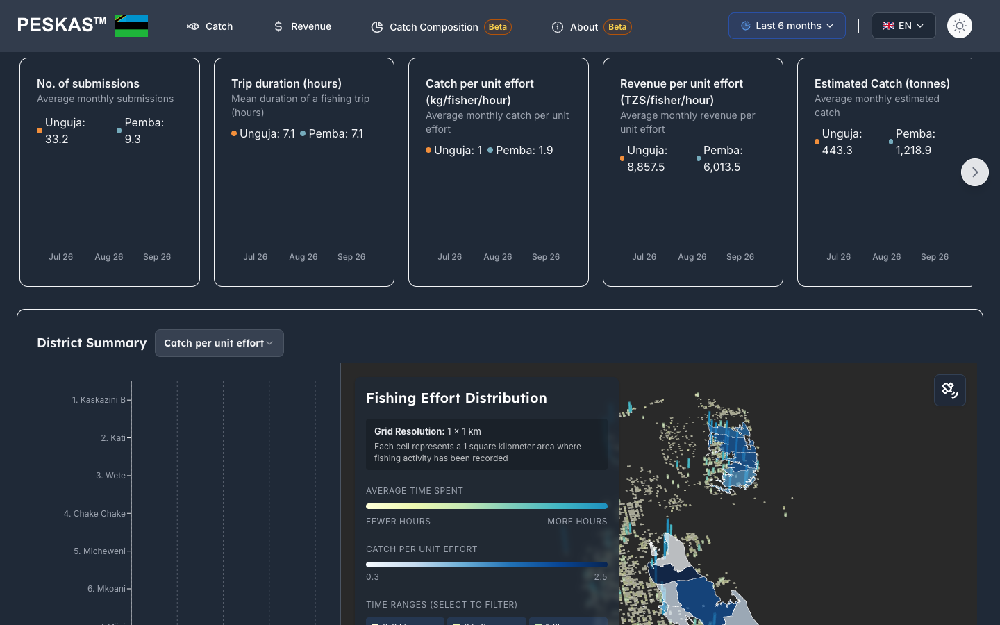

# Peskas country dashboards

One codebase for the Peskas fisheries dashboards of Zanzibar, Kenya and Mozambique. Each dashboard gives fisheries managers and researchers a view of small-scale coastal fisheries (catch, revenue, fishing effort and fishing gear), broken down by district and updated regularly from field data.

- [Peskas Zanzibar](https://zanzibar.peskas.org)
- [Peskas Kenya](https://peskas-dashboard-kenya.vercel.app/en)
- [Peskas Mozambique](https://peskas-dashboard-mozambique.vercel.app)



## What it is

Each country has its own dashboard, built from this same code. The dashboards are open: anyone can read them without an account or login. Zanzibar and Kenya are in Swahili and English; Mozambique is in Portuguese, English and Swahili.

## What you can do

- Follow catch, revenue, trip length and the number of recorded landings month by month, for the whole country or for chosen districts.
- Compare districts on a map, in a ranked chart and in a table.
- See where tracked boats spend their fishing time on a 1 km grid map of fishing effort.
- Compare fishing gears by how much each fisher catches and earns per hour.
- Explore catch composition: which species are landed, their length distribution, and how species differ between districts.
- Read the About page for background on Peskas.

## Where the data comes from

- **Landing surveys.** Enumerators (trained data collectors) record landings at landing sites. A landing is a boat's return to shore with its catch.
- **GPS trackers (Pelagic Data Systems).** Small solar-powered devices on some boats record where they travel. They feed the fishing-effort map, which covers only boats that carry a tracker.

Each country's Peskas data pipeline cleans and summarises these records by month and district, and the dashboard reads those summaries. New data appears every few days, when the pipeline runs (every 2 days for Kenya and Mozambique, every 4 days for Zanzibar).

Terms used on the dashboards:

- **Catch per unit effort**: kilograms of catch per fisher per hour of fishing.
- **Revenue per unit effort**: revenue per fisher per hour, in local currency (Tanzanian shillings for Zanzibar, Kenyan shillings for Kenya, meticais for Mozambique).

## Who runs it

The dashboards are developed and run by [WorldFish](https://worldfishcenter.org). For questions, write to <peskas.platform@gmail.com>.

## Part of Peskas

Peskas is WorldFish's open-source platform for monitoring small-scale fisheries (https://peskas.org).

- [Peskas Timor-Leste](https://timor.peskas.org): Timor-Leste portal
- [Peskas Coasts](https://coasts.peskas.org): regional comparison across countries
- [Peskas Tracks](https://tracks.peskas.org): app for fishers to see their trips and log catches
- [Peskas Kenya BMU dashboard](https://digitalfisheries.kenya.peskas.org): dashboard for Beach Management Units in Kenya
- [Peskas Management Platform](https://validation.peskas.org): data review and download for survey teams
- [Peskas Fishery Data API](https://api.peskas.org/docs): programmatic access to landing data
- Data pipelines: [Kenya](https://github.com/WorldFishCenter/peskas.kenya.data.pipeline), [Zanzibar](https://github.com/WorldFishCenter/peskas.zanzibar.data.pipeline), [Mozambique](https://github.com/WorldFishCenter/peskas.mozambique.data.pipeline), [Timor-Leste](https://github.com/WorldFishCenter/peskas.timor.data.pipeline), [Coasts](https://github.com/WorldFishCenter/peskas.coasts)

## For developers

A pnpm Turborepo whose only app is `apps/isomorphic-i18n`: a [Vite](https://vite.dev) single-page app (React Router) with a small [Nitro](https://nitro.build) server for the tRPC API. It reads the monthly summaries that `peskas.coasts::export_portal` writes to MongoDB.

**Requirements:** Node.js 20.19+ or 22.12+ (Vite 8) and pnpm 9.

**Setup**

```bash
pnpm install
cp apps/isomorphic-i18n/.env.local.example apps/isomorphic-i18n/.env
pnpm run i18n:dev    # dashboard at http://localhost:3001
```

Fill in the values in `.env`. The full list of variables the build reads is in `turbo.json`.

**One codebase, one deployment per country.** Each country is a separate Vercel project built from this repository and configured through environment variables, so adding a country needs no fork. Each deployment needs at least:

- `VITE_COUNTRY_CODE`: which country to build (`TZ`, `KE` or `MZ`; default `TZ`). Zanzibar uses `TZ`, Tanzania's country code.
- `MONGODB_URI`: the country's summaries database.
- `MONGODB_URI_COASTS`: the database that holds the district boundaries (`wio_gaul2`).
- `AUTH_SECRET`: signs the sign-in cookie and password-reset links (for example `openssl rand -base64 32`).
- `APP_URL`: the deployment's public URL, used in password-reset emails (on Vercel it falls back to the deployment URL).
- `EMAIL_SERVER` and `EMAIL_FROM`: SMTP for password-reset emails.
- `VITE_MAPBOX_TOKEN`: base map for the fishing-effort map.
- `VITE_GA_MEASUREMENT_ID`: the country's Google Analytics stream (see [`apps/isomorphic-i18n/ANALYTICS.md`](apps/isomorphic-i18n/ANALYTICS.md)).

`VITE_*` values are public and inlined into the browser bundle at build time, so changing one needs a redeploy; the others stay on the server. Country settings (districts, colours, currency, map view, languages) live in `apps/isomorphic-i18n/src/config/countries.ts`. To add a country, follow [`apps/isomorphic-i18n/COUNTRY_SETUP.md`](apps/isomorphic-i18n/COUNTRY_SETUP.md).

**Main commands**

- `pnpm run i18n:dev`, `pnpm run i18n:build`, `pnpm run i18n:lint`: run, build or lint the dashboard. `pnpm --filter i18n preview` serves a production build locally.
- `pnpm run build`, `pnpm run lint`: the whole workspace.

**Production:** the three Vercel projects (`peskas-dashboard-zanzibar`, `peskas-dashboard-kenya`, `peskas-dashboard-mozambique`) deploy to production on every push to `dev`, the default branch.

**Releases:** add a block at the top of `NEWS.md`. On every push to `dev`, `.github/workflows/release.yml` publishes that block as a GitHub release.

**Tests:** no automated test suite yet. `packages/nosql/src/test-monthly.ts` checks the monthly summaries connection and data.

**AI-assisted work:** see [`CLAUDE.md`](CLAUDE.md).
